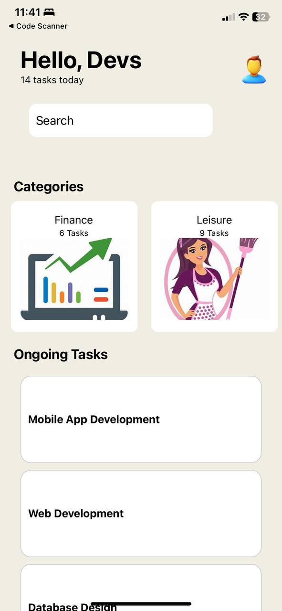
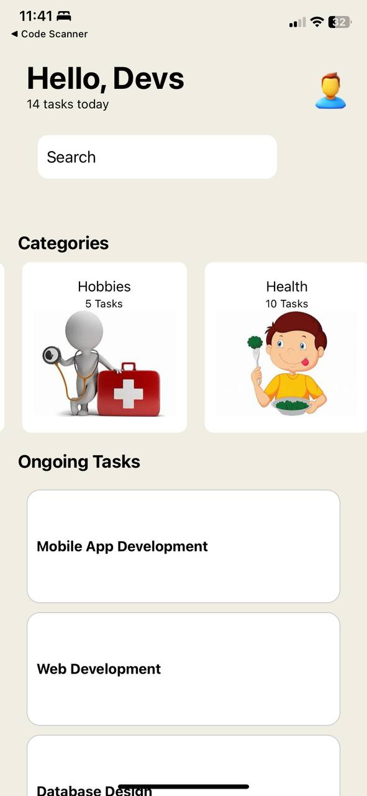
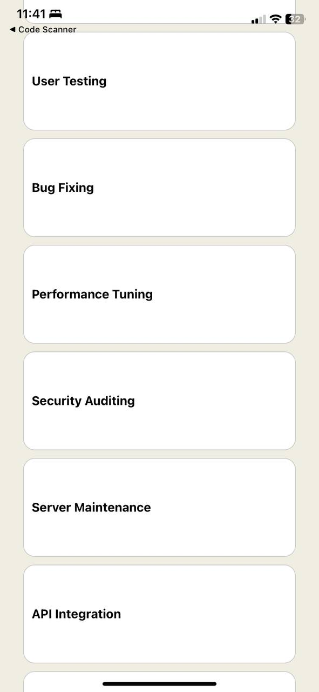

# rn-assignment-11217289
## Components

### App
- The core component of the application. It manages the overall layout, incorporating the header, search bar, categories, and task list.

### Tasks
- A collection of predefined tasks, each identified by a title.

### Categories
- A horizontally scrollable section featuring various categories such as Exercise, Study, Work, Hobbies, etc., with each category displaying an associated image and task count.

## Usage

### TextBox
- Description: A header element that shows a greeting message along with the number of tasks for the day. It also includes a user profile image and a hidden text input field.

### SearchBoxContainer
- Description: Hosts a search bar for users to find tasks and includes a search icon.

### Categories
- Description: A horizontal scroll view that presents various categories. Each category is displayed with a title, task count, and an image.

### TaskList
- Description: A vertical list of tasks rendered using a FlatList. Each task is presented with a title.

